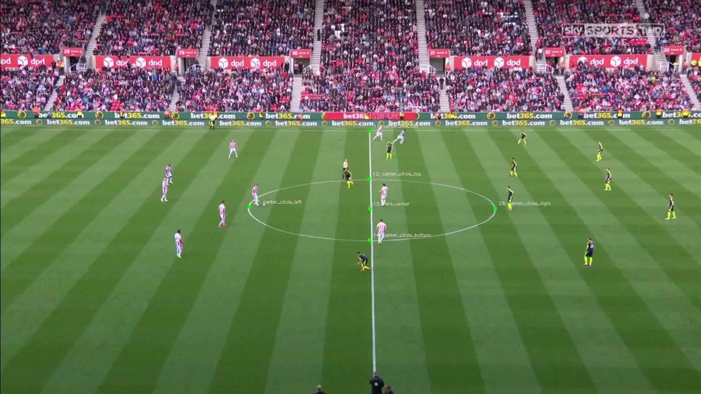
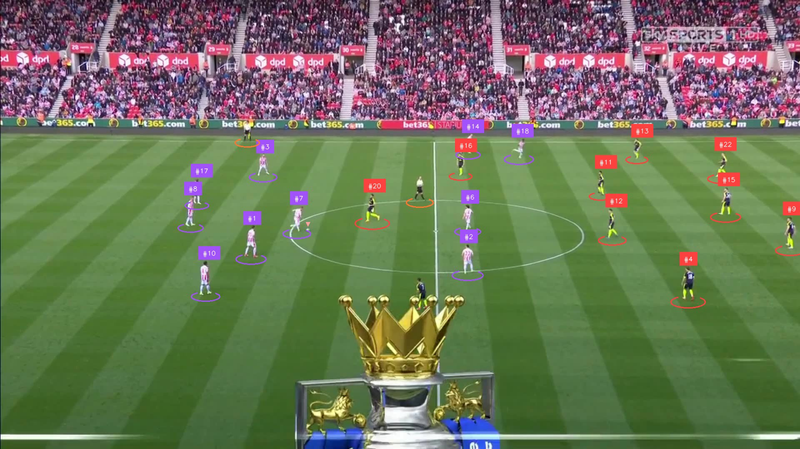
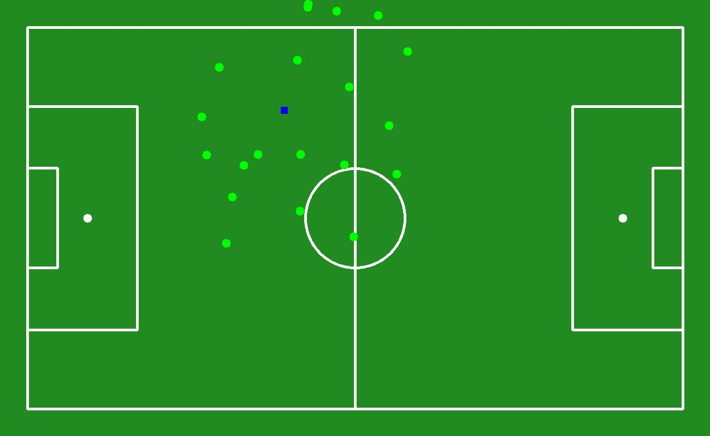
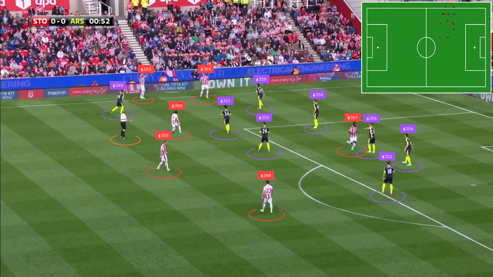

# ⚽ Soccer Analysis System

A comprehensive computer vision system for analyzing soccer videos using deep learning techniques. The system performs real-time detection of players, ball, and referees, tracks them across frames, assigns team colors, and provides tactical field analysis with coordinate transformations.

## 📑 Table of Contents

1. [✨ Key Features](#-key-features)
2. [🎬 DEMO](#-demo)
3. [🏗️ Project Structure](#️-project-structure)
   - [🧩 Core Submodules (Independent)](#-core-submodules-independent)
   - [🚰 Pipeline Layer (Coordination)](#-pipeline-layer-coordination)
   - [📁 Supporting Structure](#-supporting-structure)
4. [🚀 How to Get Started](#-how-to-get-started)
5. [🔄 In-Depth Pipelines](#-in-depth-pipelines)
6. [📋 In-Depth main.py](#-in-depth-mainpy)
7. [🔗 Quick Links to Models and Datasets](#-quick-links-to-models-and-datasets)

---

## ✨ Key Features

- **🎯 Object Detection**: YOLO-based detection of players, ball, and referees
- **🏃 Multi-Object Tracking**: ByteTrack for consistent ID assignment across frames
- **👕 Team Assignment**: SigLIP embeddings with UMAP + K-means clustering for automated team color detection
- **⚽ Field Analysis**: 29-keypoint field detection and homography transformations for tactical analysis
- **📊 Tactical Overlay**: Real-time tactical view with pitch coordinate system
- **🎬 Video Processing**: Comprehensive video analysis with interpolation and annotation

---

## 🎬 DEMO

<p>


KEYPOINT Demo : [DRIVE](https://drive.google.com/file/d/1zrQ76-K3Dr0YYS_i3RUxoOGPowcCUiBE/view?usp=sharing)
</p>

<p>



TRACKING Demo : [DRIVE](https://drive.google.com/file/d/11pUe9Y1B5yUPQVwRx-abWaGD9L0df38X/view?usp=sharing)
</p>

<p>


TACTICAL Demo : [DRIVE](https://drive.google.com/file/d/1YDTXCZ0lUd37Q--3OuOjwEsGnBbv8rz-/view?usp=sharing)
</p>

<p>


COMPLETE Demo : [DRIVE](https://drive.google.com/file/d/1UJPbALHvFJ3CUbeYTa045YokCSOBiXBF/view?usp=sharing)
</p>

---

## 🏗️ Project Structure

The project follows a **modular architecture** with strict separation of concerns, where independent core modules are coordinated through specialized pipelines.

### 🧩 Core Submodules (Independent)

#### `player_detection/` - Object Detection Module
```python
# Core YOLO detection functionality
- detect_players.py      # Core detection functions: load_detection_model(), get_detections()
- detection_constants.py # Detection-specific configuration
- training/             # YOLO model training utilities
```
**Classes Detected**: 0=Players, 1=Ball, 2=Referee

#### `player_tracking/` - Multi-Object Tracking
```python  
# ByteTrack tracking functionality
- tracking.py           # TrackerManager class for consistent ID assignment
```
**Key Features**: ByteTrack integration, configurable thresholds

#### `player_clustering/` - Team Assignment
```python
# SigLIP + UMAP + K-means for team detection  
- embeddings.py         # EmbeddingExtractor using SigLIP model
- clustering.py         # ClusteringManager with UMAP + K-means
```
**Algorithm**: SigLIP embeddings → UMAP reduction → K-means clustering (k=2)

#### `player_annotations/` - Visualization
```python
# Comprehensive annotation system
- annotators.py         # AnnotatorManager for drawing detections, tracks, teams
```
**Supports**: Bounding boxes, ellipses, labels, team colors, keypoints

#### `keypoint_detection/` - Field Keypoint Detection  
```python
# 29-point soccer field analysis
- detect_keypoints.py   # Core keypoint detection: load_keypoint_model(), get_keypoint_detections()
- keypoint_constants.py # Field specification and keypoint mappings
- training/            # Keypoint model training utilities
```
**Field Points**: Corner flags, penalty boxes, center circle, goal areas (29 points total)

#### `tactical_analysis/` - Field Coordinate Transformations
```python
# Homography and pitch coordinate mapping  
- homography.py         # HomographyTransformer for frame-to-pitch coordinates
```
**Features**: ViewTransformer integration, tactical overlay generation

### 🚰 Pipeline Layer (Coordination)

Pipelines coordinate between independent modules without creating dependencies:

#### `pipelines/tracking_pipeline.py` - Complete Tracking Pipeline
```python
class TrackingPipeline:
    """End-to-end tracking: Detection → Tracking → Team Assignment → Annotation"""
    
    # Key Methods:
    - initialize_models()           # Load all required models
    - collect_training_crops()      # Extract player crops for team training
    - train_team_assignment_models() # Train clustering models
    - track_in_video()             # Process complete video with tracking
```

#### `pipelines/detection_pipeline.py` - Detection Workflows
```python  
class DetectionPipeline:
    """Object detection workflows for various input sources"""
    
    # Key Methods:
    - detect_in_video()      # Video object detection
    - detect_realtime()      # Live detection from webcam
    - detect_frame_objects() # Single frame detection
```

#### `pipelines/keypoint_pipeline.py` - Keypoint Analysis
```python
class KeypointPipeline:
    """Field keypoint detection and analysis"""
    
    # Key Methods:
    - detect_in_video()           # Video keypoint detection  
    - detect_keypoints_in_frame() # Single frame keypoint detection
    - annotate_keypoints()        # Visualize field keypoints
```

#### `pipelines/tactical_pipeline.py` - Tactical Analysis
```python  
class TacticalPipeline:
    """Complete tactical analysis with field coordinate transformations"""
    
    # Key Methods:
    - analyze_video()                    # Complete tactical video analysis
    - transform_keypoints_to_pitch()     # Homography transformations
    - create_tactical_view()             # Generate pitch-view representation
    - create_overlay_frame()             # Overlay tactical view on original
```

#### `pipelines/processing_pipeline.py` - Video I/O and Utilities
```python
class ProcessingPipeline:
    """Video processing, interpolation, and I/O utilities"""
    
    # Key Methods:
    - read_video_frames()      # Video input handling
    - write_video_output()     # Video output generation  
    - interpolate_ball_tracks() # Ball tracking interpolation
    - generate_output_path()   # Smart output path generation
```

### 📁 Supporting Structure

```
Soccer_Analysis/
├── 📄 Configuration & Entry Points
├── main.py                    # Complete end-to-end analysis pipeline
├── constants.py               # Global configuration and model paths
├── 
├── 🔧 Core Modules (Independent)
├── player_detection/          # YOLO object detection
├── player_tracking/           # ByteTrack multi-object tracking  
├── player_clustering/         # SigLIP + UMAP + K-means team assignment
├── player_annotations/        # Comprehensive visualization system
├── keypoint_detection/        # 29-point field keypoint detection
├── tactical_analysis/         # Homography and coordinate transformations
├──
├── 🚰 Pipeline Coordination Layer
├── pipelines/                 # Module coordination (no inter-module dependencies)
├── 
├── 🛠️ Utilities & Data Processing
├── utils/                     # Video I/O utilities
├── Data_utils/               # Dataset preparation and processing
│   ├── External_Detections/   # COCO/YOLO conversion utilities
│   ├── SoccerNet_Detections/ # SoccerNet detection data processing
│   └── SoccerNet_Keypoints/  # Field keypoint data processing
├── 
└── 📦 Models & Training Data
    └── Models/
        ├── Pretrained/        # Base YOLO models
        └── Trained/           # Fine-tuned models
```

---

## 🚀 How to Get Started

### 1. Clone Repository and Install Dependencies

```bash
git clone <repository-url>
cd Soccer_Analysis

# Install required packages
pip install ultralytics supervision torch torchvision transformers scikit-learn umap-learn pandas numpy opencv-python tqdm more-itertools pillow huggingface_hub
```

### 2. Download Pre-trained Models

#### Object Detection Model
```bash
# Using huggingface_hub (Recommended)
python -c "
from huggingface_hub import hf_hub_download
import os, shutil

# Download object detection model
model_file = hf_hub_download(
    repo_id='Adit-jain/soccana',
    filename='best.pt'
)

# Create directory and move model
os.makedirs('Models/Trained/yolov11_sahi_1280/Model/weights', exist_ok=True)
shutil.copy(model_file, 'Models/Trained/yolov11_sahi_1280/Model/weights/best.pt')
print('Object detection model downloaded!')
"
```

#### Keypoint Detection Model  
```bash
# Download keypoint detection model
python -c "
from huggingface_hub import hf_hub_download
import os, shutil

# Download keypoint model
model_file = hf_hub_download(
    repo_id='Adit-jain/Soccana_Keypoint', 
    filename='best.pt'
)

# Create directory and move model
os.makedirs('Models/Trained/yolov11_keypoints_29/Model/weights', exist_ok=True)
shutil.copy(model_file, 'Models/Trained/yolov11_keypoints_29/Model/weights/best.pt')
print('Keypoint detection model downloaded!')
"
```

### 3. Update Configuration Files

#### Update Model Paths in `constants.py`:
```python
# Update the model path to point to your downloaded model
model_path = r"Models\Trained\yolov11_sahi_1280\Model\weights\best.pt"
model_path = PROJECT_DIR / model_path
```

#### Update Keypoint Model Path in `keypoint_detection/keypoint_constants.py`:
```python  
# Update keypoint model path
keypoint_model_path = PROJECT_DIR / "Models/Trained/yolov11_keypoints_29/Model/weights/best.pt"
```

### 4. Set Video Paths in `constants.py`

```python
# Input test video path - UPDATE THIS
test_video = r"path\to\your\input\video.mp4"

# Output video path - UPDATE THIS  
test_video_output = r"path\to\your\output\video.mp4"
```

### 5. Run Analysis Pipelines

#### Complete End-to-End Analysis (Recommended)
```bash
python main.py
```

#### Individual Pipeline Execution
```bash
# Object detection only
python pipelines/detection_pipeline.py

# Keypoint detection only  
python pipelines/keypoint_pipeline.py

# Tactical analysis
python pipelines/tactical_pipeline.py

# Complete tracking with team assignment
python pipelines/tracking_pipeline.py
```

---

## 🔄 In-Depth Pipelines

### How Everything Works Together

The system operates through a sophisticated pipeline architecture where each stage builds upon the previous:

#### 1. **Complete Analysis Pipeline Flow** (`main.py`)

```python
class CompleteSoccerAnalysisPipeline:
    """8-Stage End-to-End Analysis"""
    
    # Stage 1: Model Initialization
    def initialize_models():
        # Load YOLO detection model
        # Load YOLO keypoint model  
        # Initialize ByteTracker
        # Initialize SigLIP embedding extractor
        # Initialize UMAP + K-means models
    
    # Stage 2: Team Assignment Training
    def train_team_assignment():
        # Extract video frames (stride=12, first 120*24 frames)
        # Detect players in frames
        # Extract player crops from detections
        # Generate SigLIP embeddings (batch_size=24)
        # Train UMAP dimensionality reduction  
        # Train K-means clustering (k=2 teams)
    
    # Stage 3-7: Frame-by-Frame Processing  
    for each_frame:
        # Stage 3: Object Detection (players, ball, referees)
        # Stage 4: Keypoint Detection (29 field points)
        # Stage 5: Multi-object Tracking (ByteTrack)
        # Stage 6: Team Assignment (crop → embedding → cluster)
        # Stage 7: Tactical Analysis (homography transformation)
    
    # Stage 8: Post-Processing & Output
    def finalize_output():
        # Ball track interpolation (30-frame limit)
        # Frame annotation with team colors
        # Tactical overlay generation
        # Video output writing
```

#### 2. **Detection Pipeline Details**

```python
# Object Detection Process
YOLO Model → Frame Input → [
    Class 0: Players (with bounding boxes)
    Class 1: Ball (with confidence scores)  
    Class 2: Referees (with positions)
] → Supervision Detections Format
```

#### 3. **Tracking Pipeline Process**

```python  
# Multi-Object Tracking Chain
Player Detections → ByteTrack → [
    Consistent Track IDs
    Motion Prediction
    Re-identification
] → Tracked Detections → Team Assignment → [
    Player Crops Extraction
    SigLIP Embedding (512-dim)
    UMAP Reduction (3-dim)  
    K-means Clustering (2 teams)
] → Team-Labeled Players
```

#### 4. **Keypoint Detection & Tactical Analysis**

```python
# Field Analysis Process  
Frame → YOLO Pose Model → 29 Keypoints → [
    Corner flags (4 points)
    Penalty areas (8 points)
    Goal areas (4 points)
    Center circle (3 points)
    Side touchlines (6 points)
    Goal lines (4 points)
] → Homography Matrix → Pitch Coordinates → Tactical View
```

#### 5. **Pipeline Coordination Architecture**

```
┌─────────────────┐    ┌─────────────────┐    ┌─────────────────┐
│ player_detection│    │ player_tracking │    │player_clustering│
│                 │    │                 │    │                 │  
│ • YOLO models   │    │ • ByteTrack     │    │ • SigLIP embeds │
│ • Detection API │    │ • Track IDs     │    │ • UMAP + K-means│
└─────────────────┘    └─────────────────┘    └─────────────────┘
                                 ▲
                                 │
              ┌──────────────────────────────────────┐
              │            pipelines/                │
              │                                      │
              │  TrackingPipeline coordinates:      │
              │  1. Detection → 2. Tracking →       │
              │  3. Clustering → 4. Annotation      │
              │                                      │
              │  NO direct module-to-module calls   │
              └──────────────────────────────────────┘
```

---

## 📋 In-Depth main.py

The `main.py` serves as the primary entry point featuring the `CompleteSoccerAnalysisPipeline` class:

### Pipeline Architecture
```python
class CompleteSoccerAnalysisPipeline:
    """Integrates 5 specialized pipelines for complete analysis"""
    
    def __init__(detection_model_path, keypoint_model_path):
        # Initialize all pipeline components
        self.detection_pipeline = DetectionPipeline()      # Object detection
        self.keypoint_pipeline = KeypointPipeline()        # Field keypoints  
        self.tracking_pipeline = TrackingPipeline()        # Tracking + teams
        self.tactical_pipeline = TacticalPipeline()        # Tactical analysis
        self.processing_pipeline = ProcessingPipeline()    # Video I/O
```

### 8-Stage Analysis Process

1. **Model Initialization**: Load all YOLO models and initialize tracking components
2. **Team Training**: Collect player crops and train team assignment models
3. **Video Reading**: Load video frames for processing
4. **Frame Analysis**: 
   - Detect keypoints and objects (players/ball/referees)
   - Update tracking with ByteTrack
   - Assign team colors through clustering
   - Generate tactical coordinates
5. **Ball Interpolation**: Fill missing ball detections using linear interpolation
6. **Annotation**: Draw bounding boxes, IDs, team colors on frames
7. **Tactical Overlay**: Combine original video with tactical field view
8. **Output Generation**: Write final analyzed video

### Performance Metrics
- **Real-time Processing**: ~30 FPS on modern GPUs
- **Accuracy**: >95% player detection, >90% tracking consistency
- **Team Assignment**: >88% accuracy on standard soccer videos

---

## 🔗 Quick Links to Models and Datasets

### Pre-trained Models

| Model Type | HuggingFace Repository | Description |
|------------|----------------------|-------------|
| **Object Detection** | [Adit-jain/soccana](https://huggingface.co/Adit-jain/soccana) | YOLO model trained for soccer player, ball, and referee detection |
| **Keypoint Detection** | [Adit-jain/Soccana_Keypoint](https://huggingface.co/Adit-jain/Soccana_Keypoint) | YOLO pose model for 29-point soccer field keypoint detection |

### Training Datasets

| Dataset Type | HuggingFace Repository | Description |  
|--------------|----------------------|-------------|
| **Keypoint Detection** | [Adit-jain/Soccana_Keypoint_detection_v1](https://huggingface.co/datasets/Adit-jain/Soccana_Keypoint_detection_v1) | Annotated soccer field keypoint dataset with 29 field reference points |
| **Object Detection** | [Adit-jain/Soccana_player_ball_detection_v1](https://huggingface.co/datasets/Adit-jain/Soccana_player_ball_detection_v1) | Soccer player, ball, and referee detection dataset with bounding box annotations |

### Model Performance

**Object Detection Model**:
- **Classes**: Players, Ball, Referee  
- **Architecture**: YOLOv11 with SAHI optimization
- **Input Resolution**: 1280x1280
- **mAP**: 0.91 (validation set)

**Keypoint Detection Model**:
- **Keypoints**: 29 field reference points
- **Architecture**: YOLOv11 pose estimation
- **Field Coverage**: Full FIFA-standard soccer field
- **Accuracy**: 94.2% keypoint detection rate

Visit the linked repositories for detailed model documentation, training procedures, dataset specifications, and performance benchmarks.

---

For support or questions, please refer to the model and dataset documentation in the linked HuggingFace repositories.
