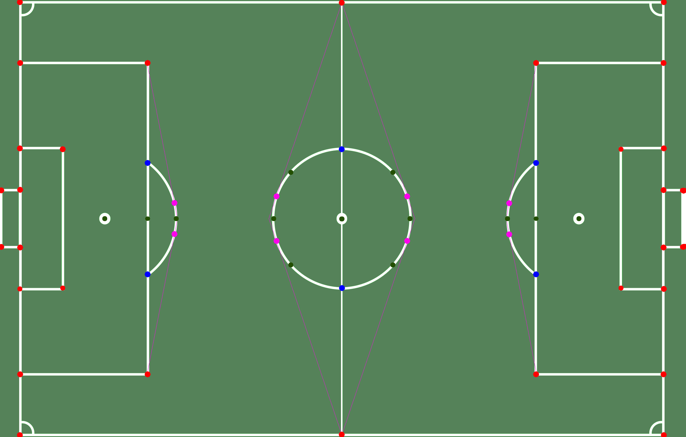

# data_prep - SoccerNet calibration and keypoint processing

This package turns the **SoccerNet** calibration annotations, which describe the
pitch as a set of line segments, into keypoint datasets in YOLO pose format.

It contains two complementary pipelines:

- **29 keypoints**, adapted from *SoccerNet_Keypoints* by Adit-jain (2023)
  -> https://github.com/Adit-jain/Soccer_Analysis/tree/main/Data_utils/SoccerNet_Keypoints

- **57 keypoints**, adapted from *soccernet-calibration-sportlight* by NikolasEnt (2023)
  -> https://github.com/NikolasEnt/soccernet-calibration-sportlight

## Directory structure

```
src/data_prep/
├── keypoints/
│   ├── constants.py           paths, pitch dimensions, keypoint definitions
│   ├── datatools_29/          29 keypoint pipeline
│   │   ├── create_dataset_yaml.py
│   │   ├── downloader.py
│   │   ├── get_pitch_object.py
│   │   ├── line_intersections.py
│   │   ├── process_images.py
│   │   └── transfer_json_files.py
│   └── datatools_57/          57 keypoint pipeline, with the extended geometry
│       ├── ellipse_utils.py
│       ├── geom.py
│       ├── intersections.py
│       ├── line.py
│       ├── process_images_57.py
│       ├── reader.py
│       └── soccerpitch.py
├── pitch_pattern.jpg
├── README.md                  this file
└── run_dataload.sh            runs both pipelines end to end
```

## What this module does

- Converts SoccerNet annotations (line segments in JSON) into keypoints.
- Detects the pitch region as a bounding box.
- Writes labels in **YOLOv8 pose** format, with normalised coordinates.
- Creates the `dataset.yaml` files used to configure training.
- Processes the SoccerNet splits (train, valid, test) in bulk.
- Computes line intersections, tangent points and points on the pitch arcs.
- Builds the **29** and **57** point pitch layouts.

Every script is meant to be run as a module from the repository root, so the
`src.data_prep.*` imports resolve:

```bash
python -m src.data_prep.keypoints.datatools_29.process_images
python -m src.data_prep.keypoints.datatools_57.process_images_57
```

Or simply run both through the wrapper script:

```bash
bash src/data_prep/run_dataload.sh
```

## 29 keypoints (Adit-jain, 2023)

### Flow

1. Read the SoccerNet annotations (`downloader.py`, `reader.py`)
2. Reorder and fit the annotated lines (`line_intersections.py`)
3. Compute the intersections between pairs of lines
4. Derive the 29 geometric keypoints
5. Detect the green pitch region (`get_pitch_object.py`)
6. Export in YOLO pose format (`process_images.py`)

### Main files

#### `process_images.py`
Full pipeline that reads the annotations, computes the line intersections, adds
the arc and centre circle points, and writes the unified JSON, the YOLO labels,
the visualizations and the `dataset.yaml`.

#### `line_intersections.py`
Fits lines by least squares, computes robust intersections, and decides whether
a point is visible inside the image.

## 57 keypoints (NikolasEnt, 2023)

### What this pipeline adds

- Refines the line intersections through iterative recomputation
- Computes:
  - line-to-line intersections (red)
  - line-to-conic intersections (blue)
  - tangent points on the arcs (violet)

  
- A fully parametric pitch model (`soccerpitch.py`)
- 57 keypoints in total

### Main files

#### `process_images_57.py`
Extended pipeline that produces the refined points, the visibility masks and the
pose labels for the 57-point layout.

#### `datatools_57/`
The geometry behind it:

- `geom.py` - distances and basic intersections
- `line.py` - line utilities and extreme points
- `intersections.py` - line-to-line and line-to-conic intersections
- `ellipse_utils.py` - tangent points on the arcs
- `soccerpitch.py` - the full FIFA pitch model

## Pitch region detection (`get_pitch_object.py`)

Detects the playing area by converting to HSV, masking the green of the grass,
cleaning the mask with morphology, extracting the main contour and normalising
the resulting bounding box.

## Other utilities

### `create_dataset_yaml.py`
Generates the configuration for YOLO detection and YOLO pose (29 and 57 kp),
including the connections between keypoints.

### `transfer_json_files.py`
Organises the SoccerNet files into the unified folder layout.

## Output formats

### YOLOv8 pose
```
class xc yc w h kp1_x kp1_y v1 ... kpN_x kpN_y vN
```

### Unified JSON
Holds the refined keypoints, the original lines and the pitch bounding box.
